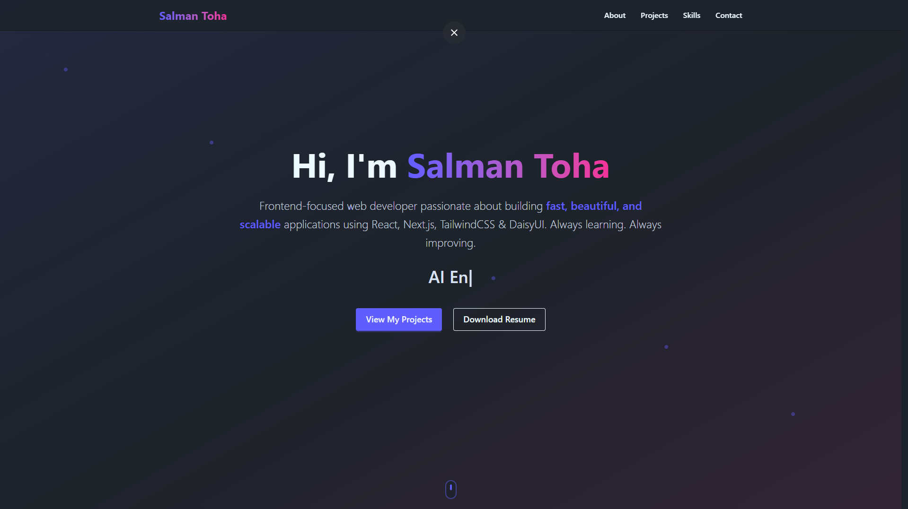

# Portfolio – Salman Toha

A modern, fully responsive personal portfolio built with **Vite + React**, styled with **Tailwind CSS** and **DaisyUI**, animated using **Framer Motion**.

Live Demo → https://portfolio-salman-toha.vercel.app



> Smooth animations • Dark/Light mode • Mobile-first

### Tech Stack

- **Vite** – Ultra-fast build tool
- **React 18** + Hooks
- **Tailwind CSS** + **DaisyUI** (components & themes)
- **Framer Motion** – Beautiful animations & scroll effects
- **React Icons** – Icon library
- **Vercel** – One-click deployment

### Features

- Hero section with typing animation
- Animated About, Skills, Projects, and Contact sections
- Square animated skills grid (hover effects)
- Real GitHub projects showcase
- Resume PDF download button
- Fully responsive (mobile ↔ desktop)
- Clean scroll indicator

### Project Structure
```
src/
├── components/
│   ├── Hero.jsx
│   ├── About.jsx
│   ├── Skills.jsx
│   ├── Projects.jsx
│   └── Contact.jsx
├── MotionDiv.jsx        ← Framer Motion wrapper
├── App.jsx
└── main.jsx
public/
└── resume.pdf           ← Your resume (downloadable)
```

### How to Run Locally

```bash
# Clone the repo
git clone https://github.com/TheLunatic1/Portfolio-Salman-Toha.git
cd Portfolio-Salman-Toha

# Install dependencies
npm install

# Start dev server
npm run dev
```
Open → http://localhost:5173

### Build for Production
```
vercel --prod
```
### Customization

- Replace public/resume.pdf with your own
- Update project links in Projects.jsx
- Change colors in tailwind.config.js
- Add/remove skills in Skills.jsx


####Made with React, Tailwind, and a lot of passion
