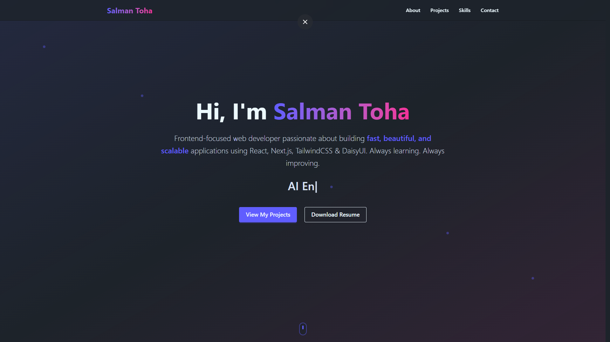

# Portfolio – Salman Toha

A modern, fully responsive personal portfolio built with **Vite 7 + React 19**, styled with **Tailwind CSS 4** and **DaisyUI 5**, animated with **Framer Motion**, and enhanced with 3D models via **Three.js / React Three Fiber**.

**Live Demo** → [salmantoha.vercel.app](https://salmantoha.vercel.app/)



> Smooth animations • 3D skill models • Auto-updating GitHub projects • Mobile-first

---

### Tech Stack

- **Vite 7** – Ultra-fast build tool with React + Tailwind plugins
- **React 19** + Hooks (StrictMode)
- **Tailwind CSS 4** + **DaisyUI 5** (utility-first + component library)
- **Framer Motion** – Scroll-reveal animations and micro-interactions
- **Three.js / @react-three/fiber / drei** – Interactive 3D skill cards
- **react-icons** – Icon library (skill grid, socials, actions)
- **react-type-animation** – Typed role rotator in Hero
- **GitHub REST API** – Live project feed (auto-sorted by stars)
- **Vercel** – Deployment

---

### Sections

| Section | Details |
|---|---|
| **Hero** | Profile photo, typed role animation, bio, education, languages, dual CTAs (Resume / GitHub), floating particles, scroll indicator |
| **Projects** | Auto-fetched from GitHub (non-forks, by stars), preview images, "Load More" pagination, skeleton loading |
| **Skills** | 5 real-time 3D skill cards (`.glb` models) + icon grid across 6 categories (Frontend, Mobile, Backend, Tools, Other, Soft Skills) |
| **Contact** | 6 social links + email/phone/location cards + Resume + "Start a Project" CTAs |

---

### Project Structure

```
src/
├── main.jsx                    Entry point
├── App.jsx                     Layout (Navbar → Hero → Projects → Skills → Contact)
├── index.css                   Tailwind + DaisyUI base
├── lib/github.js               GitHub API fetcher
└── components/
    ├── Navbar.jsx              Fixed glassy nav, smooth scroll, mobile menu
    ├── Hero.jsx                Greeting, bio, typed roles, CTAs, particles
    ├── MotionDiv.jsx           Framer Motion re-exports
    ├── Local3D.jsx             Generic 3D model card (used in Skills)
    ├── Projects/
    │   ├── Projects.jsx        GitHub repo grid + load more logic
    │   ├── ProjectCard.jsx     Repo card with preview, stars, topics
    │   └── SkeletonCard.jsx    Loading placeholder
    ├── Skills/
    │   └── Skills.jsx          Skill grid with 3D models and icons
    └── Contact/
        └── Contact.jsx         Social links, contact info cards, CTAs
public/
├── models/                     .glb 3D models (react, python, java, git, c, etc.)
└── resume.pdf                  Downloadable resume
```

---

### Getting Started

```bash
# Clone
git clone https://github.com/TheLunatic1/Portfolio-Salman-Toha.git
cd Portfolio-Salman-Toha

# Install
npm install

# Dev server
npm run dev              # http://localhost:5173

# Build
npm run build

# Preview build
npm run preview

# Lint
npm run lint
```

---

### Customization

- **Content** – Edit components under `src/components/` (Hero, Skills, Contact)
- **Social links** – Update URLs in `Contact.jsx` and `Hero.jsx`
- **Resume** – Replace `public/resume.pdf`
- **GitHub user** – Change username in `src/lib/github.js` and `ProjectCard.jsx`
- **Skills** – Add/remove items in `Skills.jsx`; add `.glb` models to `public/models/`
- **SEO** – Edit `<meta>` tags in `index.html`
- **Colors** – DaisyUI theme variables in `index.css`
- **Deploy** – `vercel --prod` (or connect your own provider)

---

### Deployment

This site is deployed via **Vercel**. Push to `main` triggers an automatic redeploy:

```bash
vercel --prod
```

Any static host (Netlify, Cloudflare Pages, GitHub Pages) also works — just point the publish directory to `dist/`.

---

Made with React, Tailwind, Three.js, and a lot of passion.
